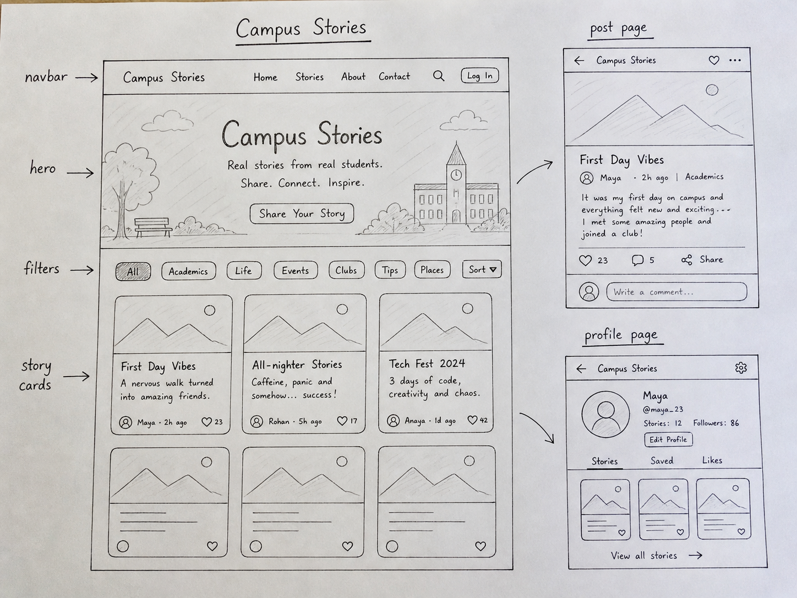

# Campus Stories - Midterm HTML/CSS/Bootstrap Redesign

**Student:** MEHRAN

## Project description

Campus Stories is a redesigned social network/blog-style web app for students. The idea is that students can share short stories about study routines, projects, clubs, campus places, events, and everyday university life.

This project is made by MEHRAN as a front-end redesign for the Introduction to Web Applications midterm assignment. The pages are static visual pages, so the buttons, likes, comments, filters, and search area are only visual design elements.

## Main visual inspiration

The main inspiration for this redesign is the Google Workspace story collection page:

https://workspace.google.com/ai/customers/

I used the general design idea from that page, especially:

- a clean light background
- a large hero section
- rounded story cards
- a card-based grid layout
- category/filter chips
- simple navigation
- readable spacing
- responsive layout for mobile screens

I did not copy Google branding, logos, exact text, or images. I only used the layout and visual style as inspiration.

## Main changes introduced

Compared with a basic social/blog page, this redesign adds:

- a new landing page with a large hero section
- a cleaner Google-inspired story card grid
- category filter chips
- improved rounded cards and spacing
- a featured individual post page
- a student profile page
- an explore/search page
- a consistent color palette
- responsive Bootstrap layout
- custom CSS styling

## Technologies used

- HTML
- CSS
- Bootstrap 5
- Bootstrap Icons

## Pages included

- `templates/index.html` - landing page / homepage
- `templates/explore.html` - explore and search page
- `templates/post.html` - individual post page
- `templates/profile.html` - student profile page

## Hand-drawn sketch

The required hand-drawn sketch is included here:



The image is stored in:

```text
static/images/sketch.jpg
```

## Responsive design

The layout uses Bootstrap containers, rows, columns, and responsive classes. On large screens, the story cards appear in multiple columns. On smaller screens, the cards stack vertically and the navigation becomes mobile-friendly.

## Notes

This is a visual redesign assignment. The app does not include real backend functionality such as real login, real comments, real search, or real likes. These elements are represented graphically to show how the final interface could look.


## Code style note

The code is intentionally kept simple and readable, like a junior web development student project. Bootstrap is used for the main layout, and the custom CSS file only adds the visual style, colors, cards, buttons, and spacing.
